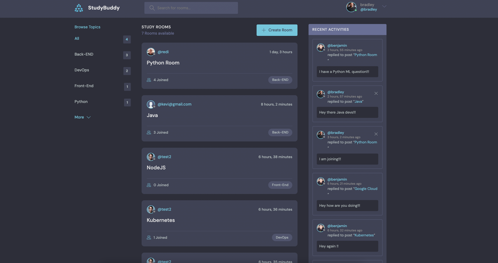
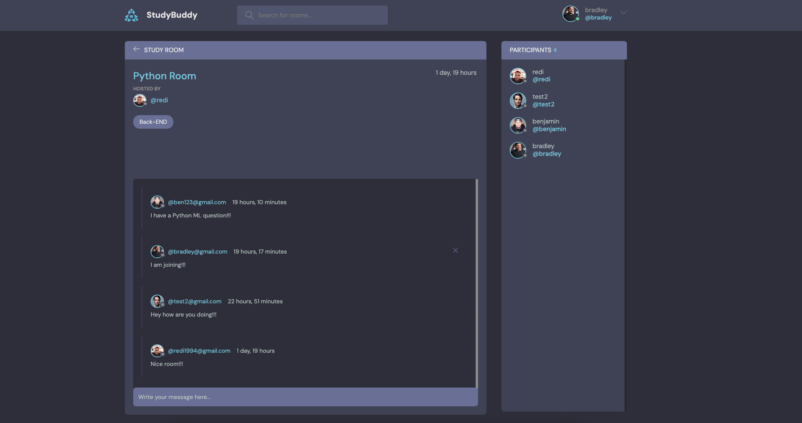
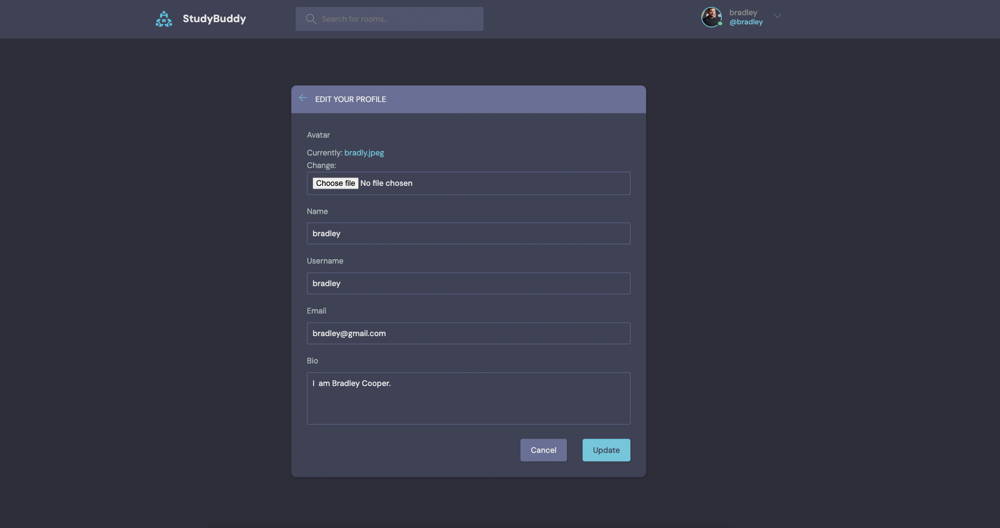
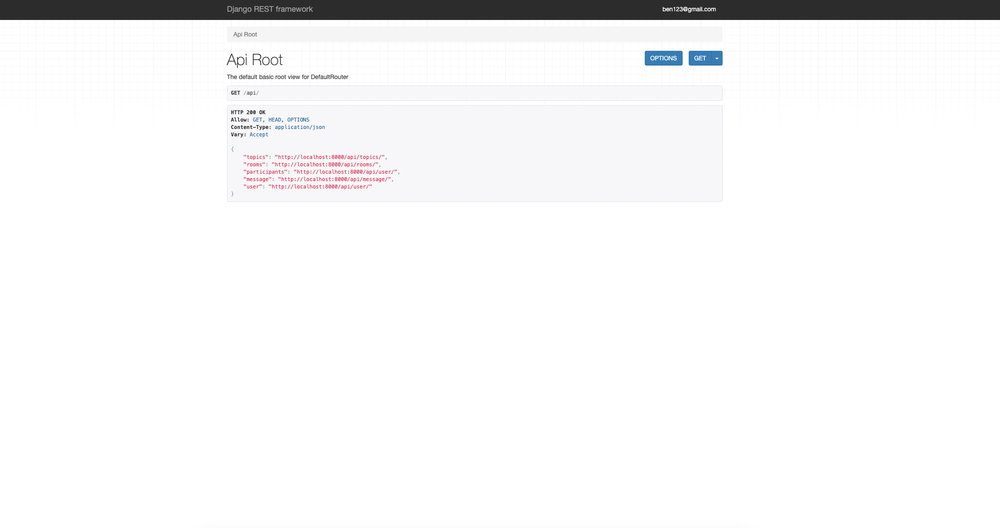

# Discord Clone

## Project Overview

The Discord Clone project is a web application built with Django in the backend and HTML/CSS in the frontend. It aims to replicate some functionalities of the popular communication platform Discord. The application allows users to create accounts, log in, and authenticate using their credentials. It features a comprehensive RESTful API powered by Django Rest Framework (DRF) that enables full CRUD (Create, Read, Update, Delete) operations on various endpoints.

Key Features:

- User Authentication:

Users can create accounts and log in to the application.
Authentication is done using a username/email and password combination.
Token-based authentication will be configured, providing secure access to API endpoints.
User Avatar and Profile:
Users can upload and use avatars to personalize their profiles.

- Topics and Rooms:

Users can create topics related to tech-related discussions and subjects.
Each topic can have multiple rooms for specific discussions within that topic.
Room Participants and Messages:

Users can participate in different rooms within a topic.
Rooms host discussions where participants can exchange messages.
Participants in a room can view and interact with messages posted in that room.
RESTful API:

- The application includes a DRF-powered API that exposes various endpoints.
Endpoints allow users to perform full CRUD operations on topics, rooms, participants, messages, and user data.
Frontend and Styling:
  
- Future Plans:

Configure Token-Based Authentication: Implement token-based authentication to secure the application's API endpoints and ensure user data protection.
Enhance User Profiles: Provide users with more options to customize their profiles and add additional information, enhancing the community experience.
Real-Time Communication: Implement real-time communication features, such as live chat and notifications, using technologies like WebSockets or Django Channels.
Endpoints:

/api/topics/: Create, retrieve, update, and delete topics.
/api/rooms/: Create, retrieve, update, and delete rooms within topics.
/api/user/: Access user profiles and information, including avatars, names, and bios.
/api/message/: Create, retrieve, update, and delete messages within rooms.


### Cloning the repository

--> Clone the repository using the command below :
```bash
git clone https://github.com/divanov11/StudyBud.git

```

--> Move into the directory where we have the project files : 
```bash
cd StudyBud

```

--> Create a virtual environment :
```bash
# Let's install virtualenv first
pip install virtualenv

# Then we create our virtual environment
virtualenv envname

```

--> Activate the virtual environment :
```bash
envname\scripts\activate

```

--> Install the requirements :
```bash
pip install -r requirements.txt

```

#

### Running the App

--> To run the App, we use :
```bash
python manage.py runserver

```

> ⚠ Then, the development server will be started at http://127.0.0.1:8000/

#

### App Preview :

<table width="100%"> 
<tr>
<td width="50%">      
&nbsp; 
<br>
<p align="center">
  Feed Home
</p>

</td> 
<td width="50%">
<br>
<p align="center">
  Room Conversation Preview
</p>
  
</td>
<tr>
<td>
<p>User Profile</p>

</td>
<td>
<p>DRF documentation</p>

</td>
</tr>

</table>

